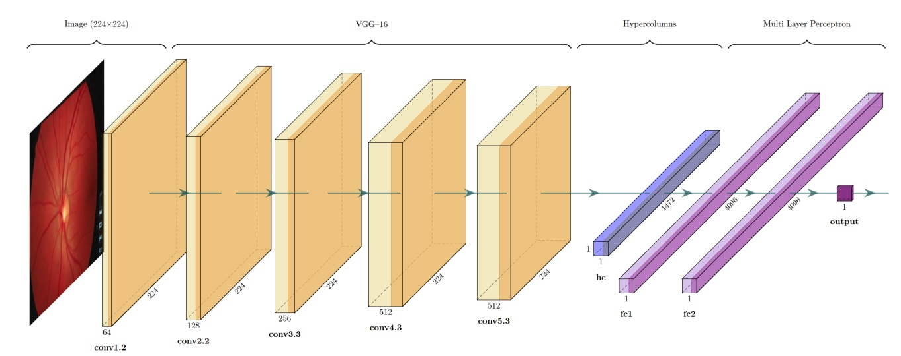

# A robust method for automated segmentation of optic disc using hypercolumn deep features

# Kemal Akyol, Murat Uçar, Yusuf Yargı Baydilli, Ümit Atila

You can test-run the example on Google Colaboratory by clicking the following button.

